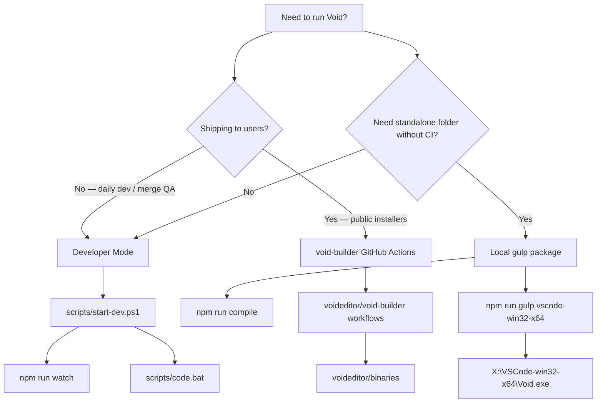
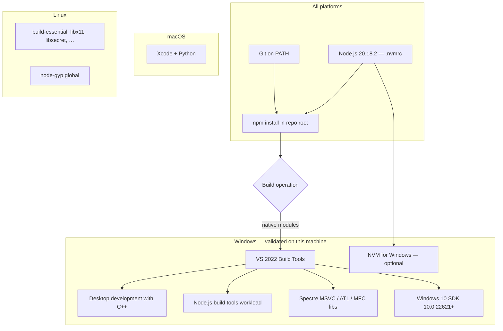
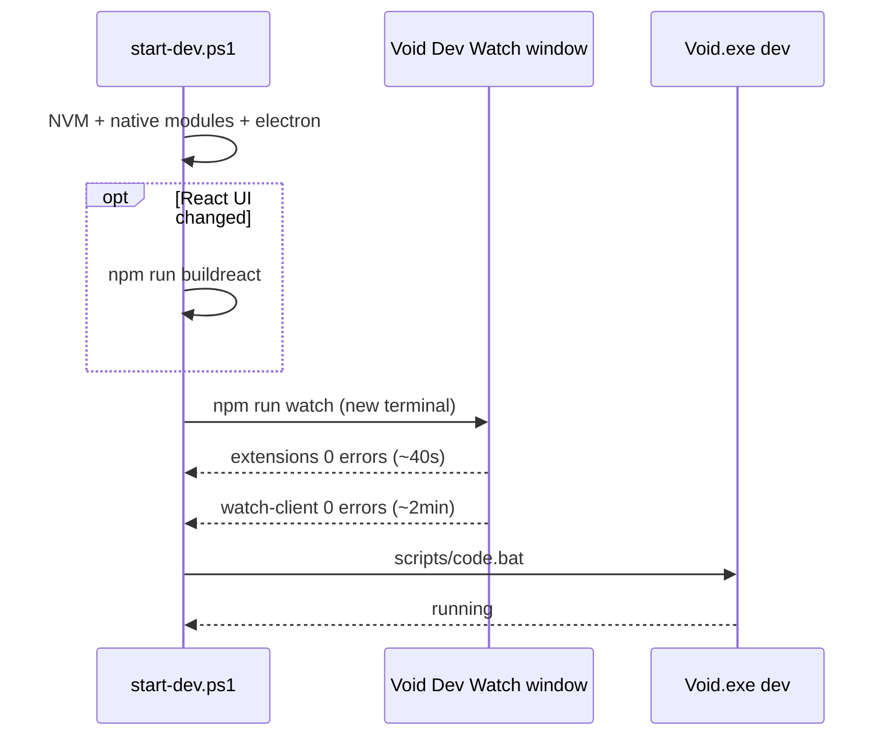
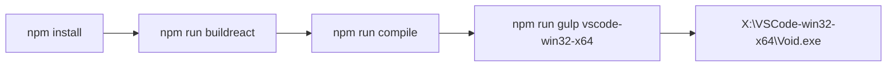
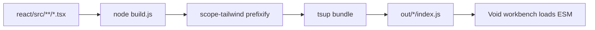

# Void Build Guide

Production build knowledge for this workspace: developer mode, local executables, and Windows toolchain. See [ECOSYSTEM.md](ECOSYSTEM.md) for CI releases via void-builder.

## Build path decision graph



| Path | Time (first run) | Output |
|------|------------------|--------|
| Developer Mode (`start-dev.ps1`) | ~2 min watch compile + ~5 s React UI | Live Electron from source |
| Local gulp (Windows x64) | ~30–60 min total | `X:\VSCode-win32-x64\Void.exe` |
| void-builder CI | ~30–90 min (runners) | Signed/platform installers |

Official upstream guide: [HOW_TO_CONTRIBUTE.md](../HOW_TO_CONTRIBUTE.md).

---

## Prerequisites knowledge graph



### Windows toolchain (proven setup)

| Component | Install method | Verified path / notes |
|-----------|----------------|----------------------|
| VS 2022 Build Tools | `winget install Microsoft.VisualStudio.2022.BuildTools` + workloads | `C:\Program Files (x86)\Microsoft Visual Studio\2022\BuildTools` |
| Windows SDK 10.0.22621 | `winget install Microsoft.WindowsSDK.10.0.22621` | `C:\Program Files (x86)\Windows Kits\10\Include\10.0.22621.0` |
| Node 20.18.2 | NVM: `nvm install 20.18.2 && nvm use 20.18.2` | `C:\Users\agnis\AppData\Local\nvm` |
| npm 11+ on Node 20 | `npm install -g npm@11` | Fixes node-gyp vs VS 17.14 detection |
| Git | Ensure folder on PATH | Use `C:\Program Files\Git\cmd` not `...\git.exe` |

Automated prerequisite script: [scripts/install-windows-build-prereqs.ps1](../scripts/install-windows-build-prereqs.ps1).

Dev launcher (watch + app): [scripts/start-dev.ps1](../scripts/start-dev.ps1) or `scripts\start-dev.bat`.

---

## Developer Mode

Recommended for Cursor merge work and feature development.

### Canonical one-liner (Windows)

From repo root — starts watch, waits for **0 errors**, opens Void:

```powershell
.\scripts\start-dev.ps1
```

Equivalent: `scripts\start-dev.bat` (no execution-policy change needed).

**Validated timeline (this machine):** `buildreact` ~5 s → extensions compile ~40 s → `watch-client` ~2 min → Void launches. Keep the **Void Dev Watch** terminal open; press **Ctrl+R** in Void after code changes.

### Fast restarts

When the React UI has **not** changed since your last run, skip `buildreact` (~5 s saved):

```powershell
.\scripts\start-dev.ps1 -SkipBuildReact
```

| Scenario | Command |
|----------|---------|
| First start / full day | `.\scripts\start-dev.ps1` |
| Restart after closing Void (watch still running) | `.\scripts\start-dev.ps1 -LaunchOnly` |
| Restart watch + app, no React changes | `.\scripts\start-dev.ps1 -SkipBuildReact` |
| Watch only (launch Void later) | `.\scripts\start-dev.ps1 -WatchOnly` then `-LaunchOnly` |

### All flags

| Flag | Effect |
|------|--------|
| `-WatchOnly` | Start watch only; no app launch |
| `-LaunchOnly` | Launch Void only (watch must already be running with 0 errors) |
| `-SkipBuildReact` | Skip `npm run buildreact` (use when Void React UI unchanged) |
| `-SkipNativeCheck` | Skip native `.node` module rebuild check |
| `-CompileTimeoutSec 900` | Max seconds to wait for first clean compile (default 15 min) |

The script automatically: sets Node 20 via NVM, approves/rebuilds native modules if needed, fetches dev Electron, runs `buildreact` (unless skipped), tails `%TEMP%\void-dev-watch.log` until both watch tasks report 0 errors, then runs `code.bat` with isolated `.tmp/user-data` and `.tmp/extensions`.



### Manual steps (alternative)

```powershell
cd X:\Void

# Node 20 via NVM (new terminal after NVM install)
$env:NVM_HOME = 'C:\Users\agnis\AppData\Local\nvm'
$env:Path = "C:\nvm4w\nodejs;$env:NVM_HOME;C:\Program Files\Git\cmd;" + [Environment]::GetEnvironmentVariable('Path','Machine')
nvm use 20.18.2

npm install
$env:NODE_OPTIONS = '--max-old-space-size=8192'
npm run buildreact
npm run watch
```

Second terminal:

```powershell
.\scripts\code.bat --user-data-dir ./.tmp/user-data --extensions-dir ./.tmp/extensions
```

Or **Ctrl+Shift+B** in VS Code/Cursor to start the build task instead of `npm run watch`.

---

## Local executable (gulp)

Produces a portable folder — **not** a void-builder release with auto-update.



### One-shot script

```powershell
.\scripts\build-windows-exe.ps1
```

### Manual commands

```powershell
nvm use 20.18.2
$env:NODE_OPTIONS = '--max-old-space-size=8192'
npm run buildreact
npm run compile
npm run gulp vscode-win32-x64
```

### Output layout

```
X:\
├── Void\                    ← repository
└── VSCode-win32-x64\        ← gulp output (sibling, not inside repo)
    ├── Void.exe             ← launcher
    ├── resources\
    ├── locales\
    └── …
```

**Status on this machine:** Build completed successfully (~4.5 min packaging after compile).

```powershell
& "X:\VSCode-win32-x64\Void.exe"
```

### Platform gulp targets

| OS | Command | Output folder |
|----|---------|---------------|
| Windows x64 | `npm run gulp vscode-win32-x64` | `../VSCode-win32-x64` |
| Windows arm64 | `npm run gulp vscode-win32-arm64` | `../VSCode-win32-arm64` |
| macOS arm64 | `npm run gulp vscode-darwin-arm64` | `../VSCode-darwin-arm64` |
| macOS x64 | `npm run gulp vscode-darwin-x64` | `../VSCode-darwin-x64` |
| Linux x64 | `npm run gulp vscode-linux-x64` | `../VSCode-linux-x64` |

---

## Windows `npm install` — Developer Command Prompt

Native modules (`tree-sitter`, etc.) require the MSVC environment. If `npm install` fails with missing Windows SDK or VS errors:

```powershell
$vcvars = "${env:ProgramFiles(x86)}\Microsoft Visual Studio\2022\BuildTools\VC\Auxiliary\Build\vcvars64.bat"
cmd /c "`"$vcvars`" && set PATH=C:\Program Files\Git\cmd;%PATH% && set WindowsSdkDir=C:\Program Files (x86)\Windows Kits\10\ && set WindowsSDKVersion=10.0.22621.0\ && cd /d X:\Void && npm install"
```

### npm 11 — approve native install scripts (required once)

npm 11 blocks `node-gyp rebuild` install scripts until approved. Without this, dev launch fails with missing `.node` bindings (e.g. `@vscode/policy-watcher`).

```powershell
nvm use 20.18.2
npm approve-scripts --all
```

Then rebuild native modules from the VS Developer environment (see `npm install` command above), or:

```powershell
npm rebuild @vscode/policy-watcher @vscode/windows-mutex @vscode/spdlog @vscode/sqlite3 @vscode/windows-registry native-keymap native-watchdog @parcel/watcher node-pty
```

Stop `npm run watch` before rebuilding if you see `EPERM` file-lock errors.

### Common failure → fix matrix

| Error | Cause | Fix |
|-------|-------|-----|
| `Could not locate the bindings file` / `vscode-policy-watcher.node` | npm 11 blocked install scripts; native modules not compiled | `npm approve-scripts --all` then `npm rebuild` (see above) |
| `Cannot find module out/main.js` | Source not compiled yet | `npm run watch` or `npm run compile` first |
| `Invalid C/C++ Compiler Toolchain` | No VS 2022 | Install Build Tools (see prerequisites) |
| `missing any Windows SDK` | SDK not linked to VS | Install Windows SDK 10.0.22621 via winget |
| `unsupported version 17.14…` + Node 20 | Old node-gyp in npm 10 | `npm install -g npm@11` on Node 20 |
| `C++20 or later required` + Node 24 | Node 24 incompatible with some native deps | Use Node 20.18.2 |
| `'git' is not recognized` | Git dir not on PATH | Add `C:\Program Files\Git\cmd` |
| React OOM | Default Node heap | `NODE_OPTIONS=--max-old-space-size=8192` |

---

## React UI build

Void mounts React + Tailwind under `src/vs/workbench/contrib/void/browser/react/`.



```powershell
$env:NODE_OPTIONS = '--max-old-space-size=8192'
npm run buildreact
```

Run after any React UI change before compile or dev reload. For day-to-day restarts when only TypeScript/workbench code changed, use `.\scripts\start-dev.ps1 -SkipBuildReact`.

---

## Production releases (void-builder)

Local gulp **does not** replace the release pipeline. For distributable installers and auto-update:

1. Clone [voideditor/void-builder](https://github.com/voideditor/void-builder) — local copy at `X:\void-builder`.
2. Fork and customize `voideditor` → your org if needed.
3. Dispatch `stable-windows` / `stable-macos` / `stable-linux` workflows.
4. Artifacts land on `voideditor/binaries`; version manifest on `voideditor/versions`.

Full ecosystem map: [ECOSYSTEM.md](ECOSYSTEM.md).

---

## Related

- [INDEX.md](INDEX.md) — documentation map
- [CURSOR_MERGE_WORKFLOW.md](CURSOR_MERGE_WORKFLOW.md) — validate merges via dev build
- [FEATURES.md](FEATURES.md) — feature locations in source
