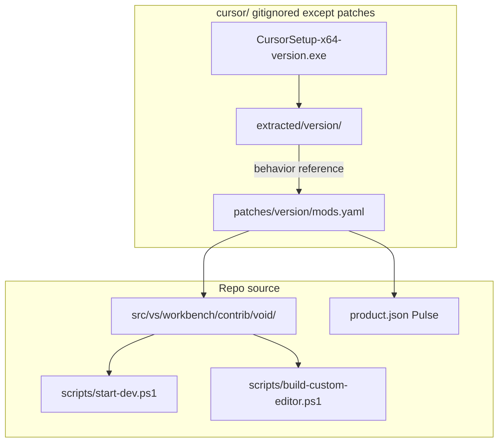

# Cursor Reference & Pulse Development Guide

Production guide for the **dual-track** editor environment: Cursor shipped client as **reference** (`cursor/`) and **Pulse** as the **implementation** (this repo's VS Code fork).

**Related:** [INDEX.md](INDEX.md) | [BUILD.md](BUILD.md) | [CURSOR_MERGE_WORKFLOW.md](CURSOR_MERGE_WORKFLOW.md) | [ECOSYSTEM.md](ECOSYSTEM.md)

## Architecture



| Track | Purpose | Output |
|-------|---------|--------|
| **Cursor reference** | Inventory, compare behavior, JSON-only config experiments | `cursor/extracted/{version}/` |
| **Pulse build** | Implement modifications in TypeScript | Dev Electron + packaged `.exe` |

**Constraint:** Extracted Cursor has **no source maps**. Do not edit minified `out/` — re-implement in `src/vs/workbench/contrib/void/`.

---

## Prerequisites

Same Windows toolchain as [BUILD.md](BUILD.md):

- Node.js **20.18.2** (`.nvmrc`)
- VS 2022 Build Tools + Windows SDK 10.0.22621+
- ~2 GB free disk per Cursor version in `cursor/extracted/`
- Cursor installer or installed Cursor at `%ProgramFiles%\cursor`

Automated prereq check:

```powershell
.\scripts\cursor-dev\setup-cursor-ref.ps1 -Version 3.7.21
```

---

## `cursor/` directory contract

```
cursor/
├── CursorSetup-x64-{version}.exe     # gitignored
├── extracted/{version}/
│   ├── installed-client/             # Full Cursor.exe + Electron
│   ├── app-resources/                # resources/app copy
│   ├── COMPONENT_MANIFEST.json
│   └── install.log
├── patches/{version}/mods.yaml       # tracked modification specs
├── mods/{version}/                   # optional JSON patch files (tracked)
└── build/{version}/                  # gitignored repack output
```

---

## Phase 1 — Extract Cursor reference

**Close Cursor** before installer-based extraction (Inno Setup aborts if Cursor is running).

```powershell
# From installed copy (Cursor may stay open for Program Files read; installer path needs Cursor closed)
.\scripts\cursor-merge\start-merge.ps1 -Version 3.7.21 -FromInstalled

# Or from installer (Cursor must be closed)
.\scripts\cursor-merge\start-merge.ps1 -Version 3.7.21 -InstallerPath cursor\CursorSetup-x64-3.7.21.exe
```

Verify:

```powershell
.\scripts\cursor-dev\verify-extraction.ps1 -Version 3.7.21
```

---

## Phase 2 — Reference dev commands

| Script | Purpose |
|--------|---------|
| [scripts/cursor-dev/setup-cursor-ref.ps1](../scripts/cursor-dev/setup-cursor-ref.ps1) | Prereqs, disk space, installer presence |
| [scripts/cursor-dev/verify-extraction.ps1](../scripts/cursor-dev/verify-extraction.ps1) | Layout + version validation |
| [scripts/cursor-dev/launch-cursor-ref.ps1](../scripts/cursor-dev/launch-cursor-ref.ps1) | Cursor ref with isolated `.tmp/cursor-ref-user-data` |
| [scripts/cursor-dev/launch-compare.ps1](../scripts/cursor-dev/launch-compare.ps1) | Cursor ref + Pulse dev side-by-side |
| [scripts/cursor-dev/apply-config-mods.ps1](../scripts/cursor-dev/apply-config-mods.ps1) | JSON-only patches on reference `app-resources` |
| [scripts/cursor-dev/repack-cursor-ref.ps1](../scripts/cursor-dev/repack-cursor-ref.ps1) | Sync `app-resources` → `installed-client` |

Launch reference client:

```powershell
.\scripts\cursor-dev\launch-cursor-ref.ps1 -Version 3.7.21
```

Side-by-side QA:

```powershell
.\scripts\cursor-dev\launch-compare.ps1 -Version 3.7.21 -SkipBuildReact
```

---

## Phase 3 — Modification lists

Tracked schema: [cursor/patches/{version}/mods.yaml](../cursor/patches/3.7.21/mods.yaml)

| Mod type | Implement in | Validate with |
|----------|--------------|---------------|
| `void_source` | `src/vs/workbench/contrib/void/` | `.\scripts\start-dev.ps1` |
| `product_json` | `product.json` | Dev launch + packaged exe |
| `extension_config` | `extensions/` or Void services | Manual QA |
| `reference_only` | Merge report only | N/A |

Wire decisions to [docs/merges/{version}/MERGE_REPORT.md](merges/3.7.21/MERGE_REPORT.md) (`implement` | `adapt` | `ignore` | `defer`).

See [cursor/patches/README.md](../cursor/patches/README.md).

---

## Phase 4 — Pulse implementation build

### Daily dev

```powershell
.\scripts\start-dev.ps1
# Fast restart: -SkipBuildReact / -LaunchOnly
```

Product name is read from [product.json](../product.json) (currently **Pulse**).

### Packaged executable

```powershell
.\scripts\build-custom-editor.ps1
# Optional side-by-side folder:
.\scripts\build-custom-editor.ps1 -CopyToCursorBuild
```

Output: `X:\VSCode-win32-x64\Pulse.exe` (sibling of repo).

Full toolchain details: [BUILD.md](BUILD.md).

---

## Validation gates

### Extraction

- [ ] `verify-extraction.ps1` passes for target version
- [ ] `package.json` version matches folder version
- [ ] `installed-client/Cursor.exe` exists under `cursor/extracted/{version}/`

### Per modification batch

- [ ] Row in `mods.yaml` + merge report
- [ ] `.\scripts\start-dev.ps1` — 0 compile errors
- [ ] Manual QA in merge report

### Release (local)

- [ ] `.\scripts\build-custom-editor.ps1` produces branded exe
- [ ] Smoke test AI sidebar, agent tool, changed behavior

---

## Legal note

Cursor `out/` and extension bundles are **proprietary**. Use extractions as **behavioral reference only**. Re-implement in open-source TypeScript. Do not redistribute modified Cursor binaries publicly without license review.

---

## Scripts quick reference

| Script | Track |
|--------|-------|
| `scripts/cursor-merge/start-merge.ps1` | Extract + merge report |
| `scripts/cursor-dev/*.ps1` | Reference workspace |
| `scripts/start-dev.ps1` | Pulse dev |
| `scripts/build-custom-editor.ps1` | Pulse packaged build |
