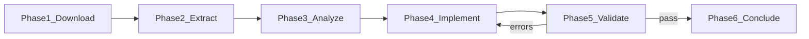

# Cursor-to-Void Feature Merge Workflow

Repeatable pipeline for evaluating a new Cursor release and porting **only what you choose** into Void.

**Related docs:** [FEATURES.md](FEATURES.md) (inventory) | [VOID_CODEBASE_GUIDE.md](../VOID_CODEBASE_GUIDE.md) (architecture) | [HOW_TO_CONTRIBUTE.md](../HOW_TO_CONTRIBUTE.md) (dev build)

## Principles

1. **You decide what ships.** Every Cursor feature drop is evaluated on its own. Nothing is merged by default.
2. **Scripts assist; they do not choose.** Extraction and manifest diff only inventory files and deltas. They never auto-select features to implement.
3. **Record decisions in the merge report.** For each changelog item or component, explicitly set: implement, adapt, ignore, or defer — with your rationale.
4. **Void may differ from Cursor.** You may port a subset, change UX, or implement the same idea differently in open source.

### Decision types (per feature / component)

| Decision | Meaning |
|----------|---------|
| `implement` | Port into Void (re-implement in TypeScript; do not copy minified bundles) |
| `adapt` | Port the idea but change behavior, scope, or UX for Void |
| `ignore` | Do not port; no further action this release |
| `defer` | Revisit later; note why |

Decisions live in `docs/merges/{version}/MERGE_REPORT.md`. Only items marked `implement` or `adapt` proceed to Phase 4.

## Overview



| Phase | Goal | Tracked in git |
|-------|------|----------------|
| 1 Download | Get installer, create branch | branch only |
| 2 Extract | Unpack app resources + manifest | `cursor/` gitignored |
| 3 Analyze & decide | Inventory + **your** implement/adapt/ignore/defer choices | `docs/merges/{version}/` |
| 4 Implement | Port features in TypeScript | source commits |
| 5 Validate | Build + manual QA until green | merge report checklist |
| 6 Conclude | Update FEATURES.md, sign off, PR | merge report + FEATURES.md |

**Legal note:** Cursor `out/` and extension `dist/` bundles are proprietary/minified. Use them as **behavioral reference only**. Re-implement in open-source TypeScript under `src/vs/workbench/contrib/void/`.

---

## Phase 1 — Download

1. Download the Windows installer from [cursor.com/downloads](https://cursor.com/downloads) or your release channel.
2. Save it as `cursor/CursorSetup-x64-{version}.exe` (e.g. `cursor/CursorSetup-x64-3.7.21.exe`). This path is **gitignored**.
3. Create a merge branch from `main`:
   ```bash
   git checkout main
   git pull
   git checkout -b Cursor-merge-{version}
   ```
4. Read the [Cursor changelog](https://www.cursor.com/changelog). Note which items you may care about — you will decide later what to port.

---

## Phase 2 — Extract

1. **Close all Cursor windows.** The Inno Setup installer aborts silently if Cursor is running.
2. Run the merge orchestrator:
   ```powershell
   .\scripts\cursor-merge\start-merge.ps1 -Version 3.7.21 -InstallerPath cursor\CursorSetup-x64-3.7.21.exe
   ```
   Or copy from an already-installed copy (no installer run):
   ```powershell
   .\scripts\cursor-merge\start-merge.ps1 -Version 3.7.21 -FromInstalled
   ```
3. Outputs (gitignored):
   - `cursor/extracted/{version}/app-resources/`
   - `cursor/extracted/{version}/COMPONENT_MANIFEST.json`

---

## Phase 3 — Analyze and decide

This phase is **human-driven**. Scripts supply raw material; you supply judgment.

1. Open or create `docs/merges/{version}/MERGE_REPORT.md` (created by `start-merge.ps1` or copy from [MERGE_REPORT.template.md](templates/MERGE_REPORT.template.md)).
2. Fill **User goals** — what you want from this release (e.g. “MCP improvements only”, “skip billing UI”).
3. Paste changelog bullets into **Changelog**.
4. Optionally diff extractions for file-level deltas (inventory only):
   ```powershell
   .\scripts\cursor-merge\diff-manifests.ps1 `
     -Old cursor\extracted\3.7.19\COMPONENT_MANIFEST.json `
     -New cursor\extracted\3.7.21\COMPONENT_MANIFEST.json `
     -OutputPath docs\merges\3.7.21\manifest-diff.txt
   ```
5. For **each** changelog item (and any extra components you find in the manifest diff), fill the **Feature decisions** table:
   - Cursor path(s) involved
   - Proposed Void target (if any)
   - **Decision:** `implement` | `adapt` | `ignore` | `defer`
   - **Rationale:** why you chose that
   - **Approach:** how Void should differ (required for `adapt`)
6. Review with stakeholders if needed. Do not start implementation until decisions are explicit.

### Component → Void reference (hints only, not a backlog)

| Cursor component | Void equivalent |
|------------------|-----------------|
| `composer` workbench contrib | `src/vs/workbench/contrib/void/` |
| `cursor-mcp` | `mcpService.ts`, `mcpChannel.ts` |
| `cursor-retrieval` | `directoryStrService.ts` |
| `cursor-agent-exec` | `toolsService.ts`, agent loop in `chatThreadService.ts` |
| `cursor-commits` | `voidSCMService.ts` |
| `cursor-always-local` | `voidSettingsService.ts` / provider routing |
| `onboarding` workbench contrib | `voidOnboardingService.ts` |
| `product.json` AI keys | `product.json` |

---

## Phase 4 — Implement in Void

Work **only** on items marked `implement` or `adapt` in the merge report.

1. Work only under `src/vs/workbench/contrib/void/` unless you have explicit approval to touch core VS Code paths (see `.voidrules`).
2. Register new services in [void.contribution.ts](../src/vs/workbench/contrib/void/browser/void.contribution.ts).
3. Update [product.json](../product.json), [voidSettingsTypes.ts](../src/vs/workbench/contrib/void/common/voidSettingsTypes.ts), or React UI as needed.
4. One logical feature (or small group) per commit on `Cursor-merge-{version}`.
5. Record changed files in the merge report **Implementation** section.

---

## Phase 5 — Validate (loop until fixed)

Repeat **implement → validate** until every checklist item passes.

### Build validation

```bash
npm run watch
```

Require **0 compilation errors** (see [HOW_TO_CONTRIBUTE.md](../HOW_TO_CONTRIBUTE.md)).

If React UI changed:

```bash
npm run buildreact
```

### Run dev build (Windows)

```bat
scripts\code.bat --user-data-dir ./.tmp/user-data --extensions-dir ./.tmp/extensions
```

Reload with Ctrl+R after code changes.

### Manual QA checklist

Record pass/fail in `docs/merges/{version}/MERGE_REPORT.md`:

| Area | Check |
|------|-------|
| Chat sidebar | Ctrl+L opens, send message, receive response |
| Quick Edit | Ctrl+K edits selection |
| Autocomplete | inline suggestions appear |
| Apply | fast/slow apply shows diffs, accept/reject works |
| Agent mode | tools run, approvals work |
| MCP | servers connect, tools callable |
| Settings | providers/models configurable |
| Decided features | checks only for items marked `implement` or `adapt` in the merge report |

If any item fails, return to Phase 4, fix, and re-run validation. Items marked `ignore` or `defer` are out of scope.

---

## Phase 6 — Conclude

1. Update [FEATURES.md](FEATURES.md):
   - Add rows to **Implemented user-facing features** for what you actually shipped
   - Update **Completed merges** with outcome summary (including what was ignored/deferred)
2. Complete the **Sign-off** section in `docs/merges/{version}/MERGE_REPORT.md`.
3. Push branch and open a PR: `Cursor-merge-{version}` → `main`.
4. After merge, tag or note the Void release that includes the port.

---

## Git tracking rules

| Path | Tracked |
|------|---------|
| `cursor/**` | No (installers + extractions) |
| `docs/merges/**` | Yes (reports, manifest-diff summaries) |
| `docs/templates/**` | Yes |
| `docs/CURSOR_MERGE_WORKFLOW.md` | Yes |
| `scripts/cursor-merge/**` | Yes |

---

## Script reference

| Script | Purpose |
|--------|---------|
| [scripts/cursor-merge/start-merge.ps1](../scripts/cursor-merge/start-merge.ps1) | Extract + inventory manifest (no merge decisions) |
| [scripts/cursor-merge/diff-manifests.ps1](../scripts/cursor-merge/diff-manifests.ps1) | File/component delta between two extractions (no merge decisions) |
| [scripts/extract-cursor-client.ps1](../scripts/extract-cursor-client.ps1) | Low-level extraction (called by start-merge) |
| [scripts/generate-cursor-manifest.ps1](../scripts/generate-cursor-manifest.ps1) | Build COMPONENT_MANIFEST.json |
