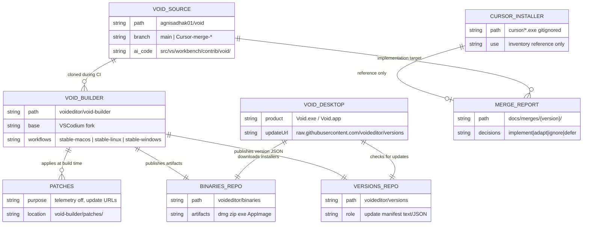
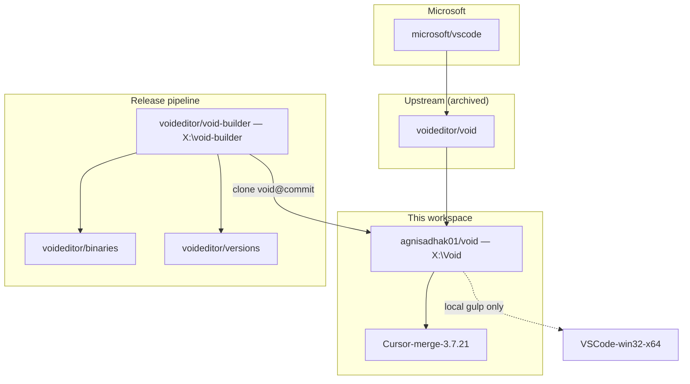
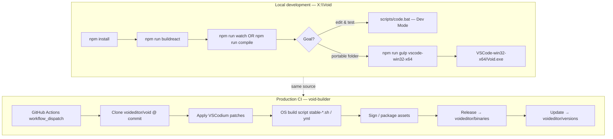
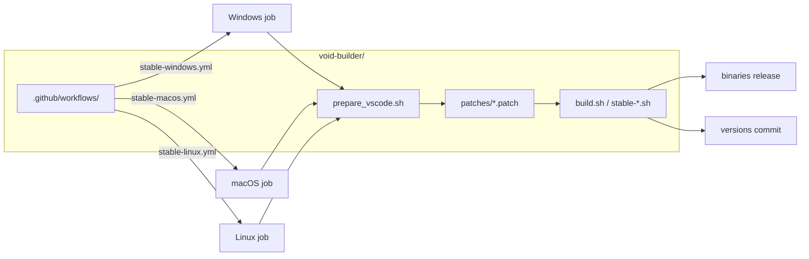
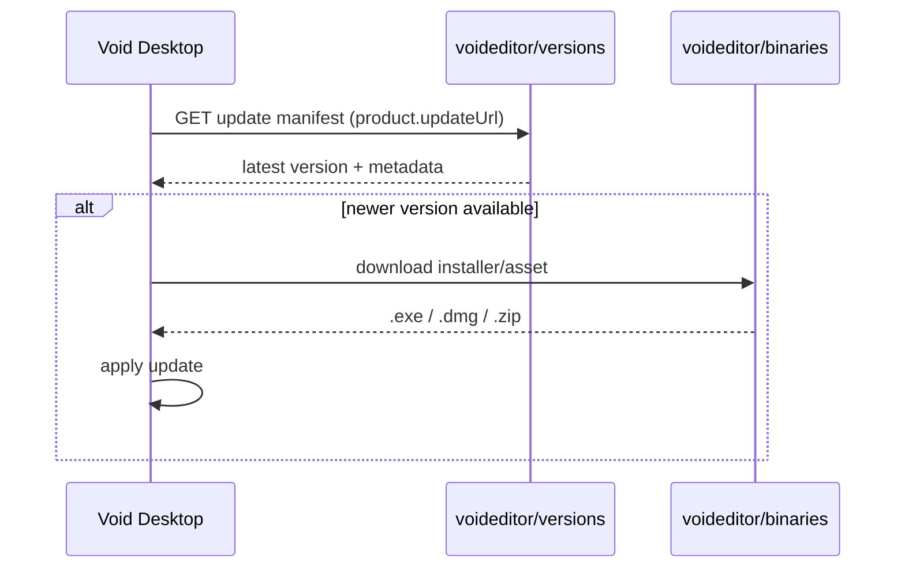

# Void Ecosystem

Production map of repositories, build pipelines, and distribution. Companion to [INDEX.md](INDEX.md).

## Ecosystem entity graph

## Repository topology

## Git remotes (Void fork)

| Remote | URL | Notes |
|--------|-----|-------|
| `origin` | `https://github.com/agnisadhak01/void.git` | Push target for this fork |
| `upstream` | `https://github.com/voideditor/void.git` | Archived; read-only reference |

## Build pipeline comparison

| Dimension | Local gulp | void-builder CI |
|-----------|------------|-----------------|
| **Trigger** | Manual on dev machine | GitHub Actions |
| **Patches** | None (raw fork source) | VSCodium patches (telemetry, update URLs) |
| **Output** | `../VSCode-win32-x64/` folder | Platform installers on `binaries` release |
| **Auto-update** | No | Yes via `versions` repo |
| **Use when** | Dev, merge QA, quick test | Public releases, website downloads |

Details: [BUILD.md](BUILD.md).

## void-builder internals

Fork of [VSCodium](https://github.com/VSCodium/vscodium). Void-specific edits are marked with caps-sensitive `Void` and `voideditor` in that repo.

### Key environment variables (CI)

| Variable | Typical value | Role |
|----------|---------------|------|
| `ASSETS_REPOSITORY` | `{owner}/binaries` | Release artifact destination |
| `VERSIONS_REPOSITORY` | `{owner}/versions` | Update manifest destination |
| `void_commit` | git SHA | Pin Void source for reproducible build |
| `void_release` | release number | Custom release counter |

### Customizing for your own distribution

1. Fork `voideditor/void-builder`.
2. Search-replace `voideditor` → your org (binaries + versions repos).
3. Search-replace `Void` → your product name in workflows and scripts.
4. Run workflows from your fork; ensure `void` source remote points to your fork.

## Auto-update flow

Patches in `void-builder/patches/` redirect VS Code's built-in update endpoints to Void URLs (`prepare_vscode.sh` sets `updateUrl` and `downloadUrl`).

## Cursor merge relationship

Cursor is **not** part of the release pipeline. It is a **reference source** for feature ports.

See [CURSOR_MERGE_WORKFLOW.md](CURSOR_MERGE_WORKFLOW.md).

## Rebasing strategy

| Repo | Rebase onto | Find changes via |
|------|-------------|------------------|
| `void/` | `microsoft/vscode` | Search `Void` in source |
| `void-builder/` | VSCodium | Search `Void`, `voideditor` |

Align VS Code and VSCodium versions when rebasing both repos.

## Related

- [BUILD.md](BUILD.md) — local build commands and Windows toolchain
- [FEATURES.md](FEATURES.md) — what Void implements
- [INDEX.md](INDEX.md) — documentation map
