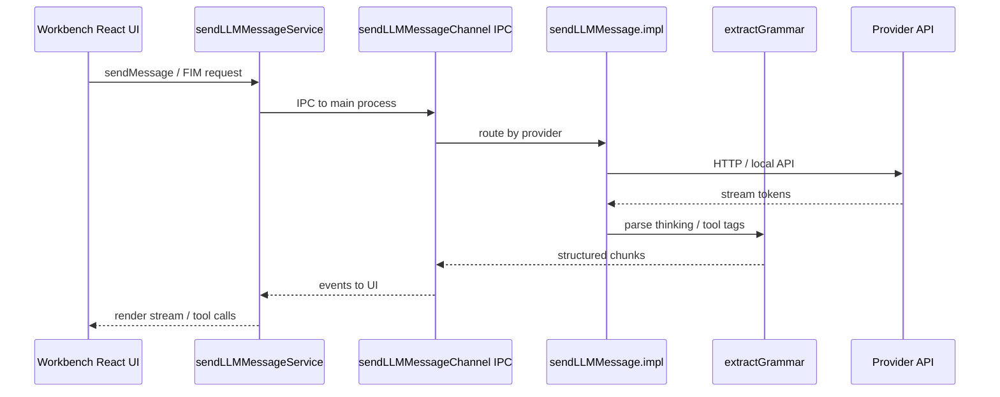
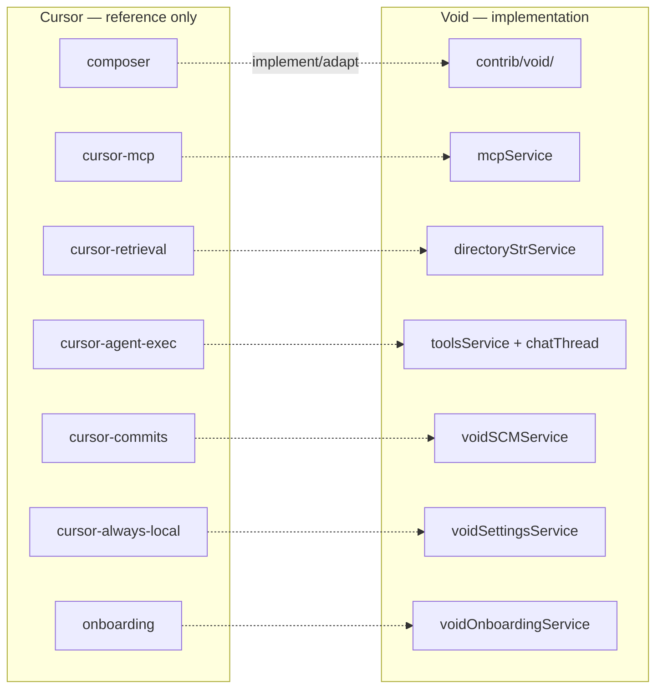

# Void Feature Inventory

Living inventory of what this fork implements today, what is partial or disabled, and a **reference map** of Cursor components (not a merge backlog).

This document is grounded in source code. For architecture deep-dives, see [VOID_CODEBASE_GUIDE.md](../VOID_CODEBASE_GUIDE.md).

**Merge workflow:** [CURSOR_MERGE_WORKFLOW.md](CURSOR_MERGE_WORKFLOW.md) — evaluate each Cursor release; **you** decide per feature what to implement, adapt, ignore, or defer.

**Docs map:** [INDEX.md](INDEX.md) | **Build:** [BUILD.md](BUILD.md) (`.\scripts\start-dev.ps1`) | **Ecosystem:** [ECOSYSTEM.md](ECOSYSTEM.md)

## Feature domain knowledge graph

```mermaid
graph TB
  subgraph ui["User-facing UI — React ESM bundles"]
    SIDEBAR[Chat sidebar Ctrl+L]
    QEDIT[Quick Edit Ctrl+K]
    SETTINGS[Settings pane]
    ONBOARD[Onboarding]
    TOOLTIP[Tooltips]
    WIDGETS[Editor widgets]
  end

  subgraph agent["Agent & chat"]
    THREAD[chatThreadService]
    MODES[normal | gather | agent]
    TOOLS[toolsService]
    TERM[terminalToolService]
  end

  subgraph llm["LLM pipeline — browser ↔ main"]
    SEND_SVC[sendLLMMessageService]
    SEND_CH[sendLLMMessageChannel]
    SEND_IMPL[sendLLMMessage.impl]
    GRAMMAR[extractGrammar]
  end

  subgraph edit["Code editing"]
    EDIT[editCodeService — Apply]
    MODEL[voidModelService]
    AUTOCOMPLETE[autocompleteService FIM]
    CMD_BAR[voidCommandBarService]
  end

  subgraph config["Configuration"]
    VOID_SET[voidSettingsService]
    CAPS[modelCapabilities — providers]
    MCP[mcpService + mcpChannel]
  end

  SIDEBAR --> THREAD
  QEDIT --> EDIT
  THREAD --> MODES
  MODES --> TOOLS
  TOOLS --> TERM
  THREAD --> SEND_SVC
  SEND_SVC --> SEND_CH --> SEND_IMPL --> GRAMMAR
  EDIT --> MODEL
  AUTOCOMPLETE --> SEND_SVC
  SETTINGS --> VOID_SET --> CAPS
  MCP --> TOOLS
```

## Product & branch context

| Item | Value |
|------|-------|
| Void version | `1.4.9` (`voidRelease` `0044` in [product.json](../product.json)) |
| Active merge branch | `Cursor-merge-3.7.21` |
| Cursor merge target | Client **3.7.21** / VS Code **1.105.1** |
| Void AI code location | `src/vs/workbench/contrib/void/` |

## How to maintain this doc

When you register a new service or user-facing feature in [void.contribution.ts](../src/vs/workbench/contrib/void/browser/void.contribution.ts), add a row to the tables below.

Per-release Cursor decisions live in `docs/merges/{version}/MERGE_REPORT.md`, not here.

Status legend (Void features): `implemented` | `partial` | `disabled`

---

## Implemented user-facing features

Derived from [void.contribution.ts](../src/vs/workbench/contrib/void/browser/void.contribution.ts) and [voidSettingsTypes.ts](../src/vs/workbench/contrib/void/common/voidSettingsTypes.ts).

| Feature | Status | User entry | Primary code |
|---------|--------|------------|--------------|
| Chat sidebar | `implemented` | Ctrl+L | [sidebarPane.ts](../src/vs/workbench/contrib/void/browser/sidebarPane.ts), [sidebarActions.ts](../src/vs/workbench/contrib/void/browser/sidebarActions.ts), React [sidebar-tsx/](../src/vs/workbench/contrib/void/browser/react/src/sidebar-tsx/) |
| Quick Edit | `implemented` | Ctrl+K | [quickEditActions.ts](../src/vs/workbench/contrib/void/browser/quickEditActions.ts) |
| Autocomplete (FIM) | `implemented` | inline suggestions | [autocompleteService.ts](../src/vs/workbench/contrib/void/browser/autocompleteService.ts) |
| Apply (fast / slow) | `implemented` | Apply button, agent edits | [editCodeService.ts](../src/vs/workbench/contrib/void/browser/editCodeService.ts) |
| Diff review | `implemented` | accept / reject keybinds | [actionIDs.ts](../src/vs/workbench/contrib/void/browser/actionIDs.ts), [voidCommandBarService.ts](../src/vs/workbench/contrib/void/browser/voidCommandBarService.ts) |
| Settings UI | `implemented` | settings pane | [voidSettingsPane.ts](../src/vs/workbench/contrib/void/browser/voidSettingsPane.ts), React [void-settings-tsx/](../src/vs/workbench/contrib/void/browser/react/src/void-settings-tsx/) |
| Onboarding | `implemented` | first-run flow | [voidOnboardingService.ts](../src/vs/workbench/contrib/void/browser/voidOnboardingService.ts) |
| SCM commit messages | `implemented` | SCM feature slot | [voidSCMService.ts](../src/vs/workbench/contrib/void/browser/voidSCMService.ts), [voidSCMMainService.ts](../src/vs/workbench/contrib/void/electron-main/voidSCMMainService.ts) |
| Extension / settings import | `implemented` | import from other editors | [extensionTransferService.ts](../src/vs/workbench/contrib/void/browser/extensionTransferService.ts) |
| Auto-update UI | `implemented` | update actions | [voidUpdateActions.ts](../src/vs/workbench/contrib/void/browser/voidUpdateActions.ts), [voidUpdateService.ts](../src/vs/workbench/contrib/void/common/voidUpdateService.ts) |
| Selection helper | `implemented` | editor widget | [voidSelectionHelperWidget.ts](../src/vs/workbench/contrib/void/browser/voidSelectionHelperWidget.ts) |
| Thread history | `implemented` | sidebar threads | [chatThreadService.ts](../src/vs/workbench/contrib/void/browser/chatThreadService.ts) |
| Explorer file actions | `implemented` | context menu | [fileService.ts](../src/vs/workbench/contrib/void/browser/fileService.ts) |
| Tooltips | `implemented` | UI hints | [tooltipService.ts](../src/vs/workbench/contrib/void/browser/tooltipService.ts) |

---

## AI and agent capabilities

### Feature slots

Per-model configuration slots defined in [voidSettingsTypes.ts](../src/vs/workbench/contrib/void/common/voidSettingsTypes.ts):

`Chat` | `Ctrl+K` | `Autocomplete` | `Apply` | `SCM`

### Chat modes

| Mode | Tools | Notes |
|------|-------|-------|
| `normal` | none | chat only |
| `gather` | read/search tools only | no edit or terminal tools |
| `agent` | all builtin tools + MCP | full agent loop |

Tool availability is computed in `availableTools()` in [prompts.ts](../src/vs/workbench/contrib/void/common/prompt/prompts.ts).

### Builtin agent tools

Defined in `builtinTools` in [prompts.ts](../src/vs/workbench/contrib/void/common/prompt/prompts.ts). Implemented in [toolsService.ts](../src/vs/workbench/contrib/void/browser/toolsService.ts) and [terminalToolService.ts](../src/vs/workbench/contrib/void/browser/terminalToolService.ts).

**Read / search**

- `read_file`
- `ls_dir`
- `get_dir_tree`
- `search_pathnames_only`
- `search_for_files`
- `search_in_file`
- `read_lint_errors`

**Edit**

- `create_file_or_folder`
- `delete_file_or_folder`
- `edit_file` (search/replace blocks)
- `rewrite_file`

**Terminal**

- `run_command`
- `open_persistent_terminal`
- `run_persistent_command`
- `kill_persistent_terminal`

### MCP (Model Context Protocol)

| Capability | Status | Code |
|------------|--------|------|
| `mcp.json` config | `implemented` | [mcpService.ts](../src/vs/workbench/contrib/void/common/mcpService.ts) |
| Main-process IPC channel | `implemented` | [mcpChannel.ts](../src/vs/workbench/contrib/void/electron-main/mcpChannel.ts) |
| Server toggle & tool passthrough | `implemented` | `mcpService.ts` |

### LLM providers

Configured in [modelCapabilities.ts](../src/vs/workbench/contrib/void/common/modelCapabilities.ts):

`anthropic` | `openAI` | `deepseek` | `ollama` | `vLLM` | `openRouter` | `openAICompatible` | `gemini` | `groq` | `xAI` | `mistral` | `lmStudio` | `liteLLM` | `googleVertex` | `microsoftAzure` | `awsBedrock`

Local auto-detected providers: `ollama`, `vLLM`, `lmStudio`.

### LLM pipeline



Key files:

- [sendLLMMessageService.ts](../src/vs/workbench/contrib/void/common/sendLLMMessageService.ts)
- [sendLLMMessageChannel.ts](../src/vs/workbench/contrib/void/electron-main/sendLLMMessageChannel.ts)
- [sendLLMMessage.impl.ts](../src/vs/workbench/contrib/void/electron-main/llmMessage/sendLLMMessage.impl.ts)
- [extractGrammar.ts](../src/vs/workbench/contrib/void/electron-main/llmMessage/extractGrammar.ts) — thinking/tool tag grammars

See the LLM Message Pipeline section in [VOID_CODEBASE_GUIDE.md](../VOID_CODEBASE_GUIDE.md).

### Supporting services

| Service | Role | Code |
|---------|------|------|
| Settings | providers, models, global config | [voidSettingsService.ts](../src/vs/workbench/contrib/void/common/voidSettingsService.ts) |
| Model / file sync | background file edits | [voidModelService.ts](../src/vs/workbench/contrib/void/common/voidModelService.ts) |
| Directory context | workspace tree for prompts | [directoryStrService.ts](../src/vs/workbench/contrib/void/common/directoryStrService.ts) |
| Model refresh | poll local providers | [refreshModelService.ts](../src/vs/workbench/contrib/void/common/refreshModelService.ts) |
| Metrics | usage telemetry | [metricsService.ts](../src/vs/workbench/contrib/void/common/metricsService.ts) |

---

## Partial or disabled

| Item | Status | Notes |
|------|--------|-------|
| Context gathering | `disabled` | [contextGatheringService.ts](../src/vs/workbench/contrib/void/browser/contextGatheringService.ts) exists but import is commented out in `void.contribution.ts`; autocomplete integration is also commented |
| Context user changes | `disabled` | import commented out in `void.contribution.ts` (no source file in repo yet) |

---

## Cursor component reference

**Not a merge backlog.** When a new Cursor version drops, use [CURSOR_MERGE_WORKFLOW.md](CURSOR_MERGE_WORKFLOW.md) and record per-feature decisions in `docs/merges/{version}/MERGE_REPORT.md`.



This table helps map Cursor paths to Void code when **you** choose to implement or adapt something. Cursor `out/` and extension `dist/` are reference-only; re-implement in TypeScript.

| Cursor component | Possible Void equivalent | Notes |
|------------------|------------------------|-------|
| `composer` workbench contrib | `src/vs/workbench/contrib/void/` | Cursor AI UI vs Void React sidebar |
| `cursor-mcp` extension | `mcpService`, `mcpChannel` | MCP config and tool routing |
| `cursor-retrieval` extension | `directoryStrService` | Indexing / codebase context |
| `cursor-agent-exec` extension | `toolsService`, agent loop | Agent execution |
| `cursor-commits` extension | `voidSCMService` | SCM / commit AI |
| `cursor-always-local` extension | `voidSettingsService` | Local-only routing |
| `onboarding` workbench contrib | `voidOnboardingService` | First-run UX |
| `product.json` AI keys | `product.json` | Domains, extension maps |
| Other `cursor-*` extensions | _(case by case)_ | See extraction manifest |

Local inventory only (gitignored): `cursor/extracted/{version}/COMPONENT_MANIFEST.json` via `scripts/cursor-merge/start-merge.ps1`.

---

## Completed merges

| Cursor version | Branch | Report | Status |
|----------------|--------|--------|--------|
| 3.7.21 | `Cursor-merge-3.7.21` | [MERGE_REPORT.md](merges/3.7.21/MERGE_REPORT.md) | `in_progress` |

---

## Related docs

- [INDEX.md](INDEX.md) — documentation knowledge graph
- [BUILD.md](BUILD.md) — dev mode (`start-dev.ps1`) and local executable
- [ECOSYSTEM.md](ECOSYSTEM.md) — void-builder and release pipeline
- [README.md](../README.md) — project overview
- [CURSOR_MERGE_WORKFLOW.md](CURSOR_MERGE_WORKFLOW.md) — Cursor → Void merge playbook
- [VOID_CODEBASE_GUIDE.md](../VOID_CODEBASE_GUIDE.md) — architecture and terminology
- [HOW_TO_CONTRIBUTE.md](../HOW_TO_CONTRIBUTE.md) — dev setup
- [External Void roadmap](https://github.com/orgs/voideditor/projects/2) — upstream planned work (not tracked in-repo)
