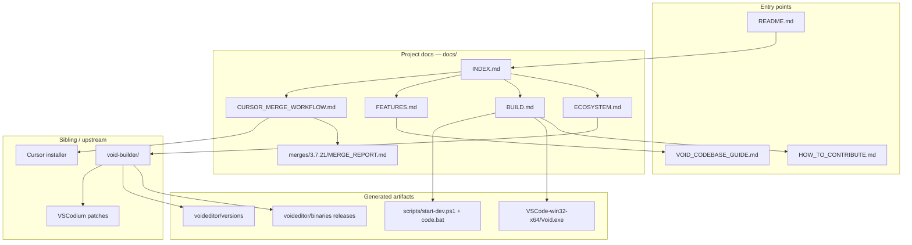
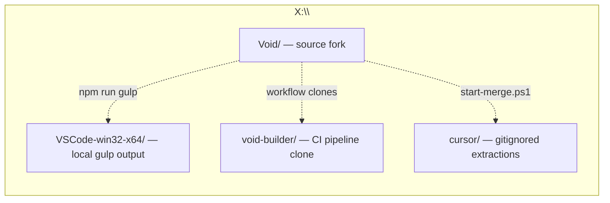

# Void Documentation Index

Central map of project knowledge. Each linked doc contains **production-grade knowledge graphs** (Mermaid): entities, relationships, artifacts, and decision flows.

## Documentation knowledge graph

## Document catalog

| Document | Purpose | Knowledge graphs |
|----------|---------|------------------|
| [ECOSYSTEM.md](ECOSYSTEM.md) | Repos, remotes, CI/CD, auto-update distribution | Ecosystem, git, release pipeline, update flow |
| [BUILD.md](BUILD.md) | Dev mode, local executable, Windows toolchain | Build paths, prerequisite DAG, command sequence |
| [FEATURES.md](FEATURES.md) | Implemented Void features + Cursor reference map | AI subsystem, services, component mapping |
| [CURSOR_MERGE_WORKFLOW.md](CURSOR_MERGE_WORKFLOW.md) | User-driven Cursor → Void merge playbook | Phase flow, decision ontology, git tracking |
| [merges/3.7.21/MERGE_REPORT.md](merges/3.7.21/MERGE_REPORT.md) | Active merge decisions for Cursor 3.7.21 | _(per-release tables)_ |
| [templates/MERGE_REPORT.template.md](templates/MERGE_REPORT.template.md) | Template for future merge reports | — |

## Upstream references (not duplicated here)

| Document | Location |
|----------|----------|
| Codebase architecture & terminology | [VOID_CODEBASE_GUIDE.md](../VOID_CODEBASE_GUIDE.md) |
| Official contribute guide | [HOW_TO_CONTRIBUTE.md](../HOW_TO_CONTRIBUTE.md) |
| void-builder (VSCodium fork CI) | `X:\void-builder\` — see [ECOSYSTEM.md](ECOSYSTEM.md) |

## Workspace layout (this machine)

| Path | Git remote | Role |
|------|------------|------|
| `X:\Void` | `origin` → `agnisadhak01/void` | Active development fork |
| `X:\Void` | `upstream` → `voideditor/void` (archived) | Historical upstream |
| `X:\void-builder` | `origin` → `voideditor/void-builder` | Release pipeline reference |
| `X:\VSCode-win32-x64` | _(not in git)_ | Local packaged Void (`Void.exe`) |
| `X:\Void\cursor\` | gitignored | Cursor installers + extractions |

## Quick navigation by task

| I want to… | Start here |
|------------|------------|
| Understand repos and releases | [ECOSYSTEM.md](ECOSYSTEM.md) |
| Run Void from source (daily dev) | `.\scripts\start-dev.ps1` — [BUILD.md](BUILD.md) § Developer Mode |
| Build `Void.exe` locally | [BUILD.md](BUILD.md) § Local executable |
| Port Cursor features | [CURSOR_MERGE_WORKFLOW.md](CURSOR_MERGE_WORKFLOW.md) |
| See what Void implements today | [FEATURES.md](FEATURES.md) |
| Ship installers via GitHub Actions | [ECOSYSTEM.md](ECOSYSTEM.md) § void-builder |
