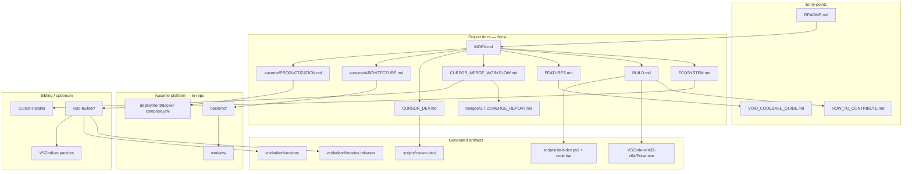
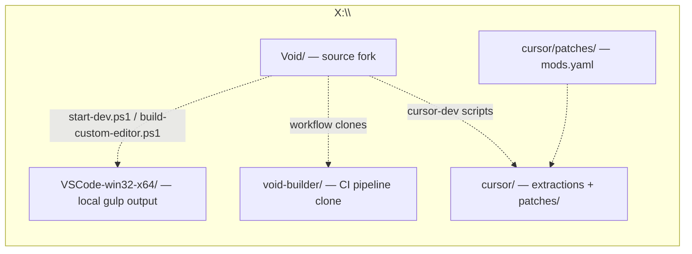

# Void Documentation Index

Central map of project knowledge. Each linked doc contains **production-grade knowledge graphs** (Mermaid): entities, relationships, artifacts, and decision flows.

## Documentation knowledge graph

## Document catalog

| Document | Purpose | Knowledge graphs |
|----------|---------|------------------|
| [ECOSYSTEM.md](ECOSYSTEM.md) | Repos, remotes, CI/CD, auto-update distribution | Ecosystem, git, release pipeline, update flow |
| [BUILD.md](BUILD.md) | Dev mode (`start-dev.ps1`), local executable, Windows toolchain | Build paths, prerequisite DAG, command sequence |
| [FEATURES.md](FEATURES.md) | Implemented Void features + Cursor reference map | AI subsystem, services, component mapping |
| [CURSOR_MERGE_WORKFLOW.md](CURSOR_MERGE_WORKFLOW.md) | User-driven Cursor → Void merge playbook | Phase flow, decision ontology, git tracking |
| [CURSOR_DEV.md](CURSOR_DEV.md) | Cursor reference workspace + Pulse dual-track dev | Reference vs implementation architecture |
| [merges/3.7.21/MERGE_REPORT.md](merges/3.7.21/MERGE_REPORT.md) | Active merge decisions for Cursor 3.7.21 | _(per-release tables)_ |
| [templates/MERGE_REPORT.template.md](templates/MERGE_REPORT.template.md) | Template for future merge reports | — |

## Ausome AI Studio (platform)

| Document | Purpose |
|----------|---------|
| [ausome/ARCHITECTURE.md](ausome/ARCHITECTURE.md) | Hybrid orchestration, observability, modular monolith topology |
| [ausome/ROADMAP.md](ausome/ROADMAP.md) | M1–M16 engineering milestones (complete) + productization pointer |
| [ausome/PRODUCTIZATION.md](ausome/PRODUCTIZATION.md) | Phases A–I — **Phase A (Agent Observatory)** implemented |
| [ausome/SECURITY.md](ausome/SECURITY.md) | Auth, RBAC, audit, sandbox, OPA, rate limits |
| [../backend/README.md](../backend/README.md) | All Python packages, schemas v1–v4, API table |
| [../backend/api-gateway/README.md](../backend/api-gateway/README.md) | Gateway routes, env, local run |
| [../backend/agent-service/README.md](../backend/agent-service/README.md) | Agent runtime state machine |
| [../deployment/README.md](../deployment/README.md) | Docker Compose: postgres, minio, gateway, sandbox, workers |
| [../workers/README.md](../workers/README.md) | Indexing + graph-indexing workers |
| [../ai/README.md](../ai/README.md) | Model matrix (M15), embedding cost config |
| [../infrastructure/README.md](../infrastructure/README.md) | Kubernetes namespaces + Helm charts |

## Upstream references (not duplicated here)

| Document | Location |
|----------|----------|
| Codebase architecture & terminology | [VOID_CODEBASE_GUIDE.md](../VOID_CODEBASE_GUIDE.md) |
| Official contribute guide | [HOW_TO_CONTRIBUTE.md](../HOW_TO_CONTRIBUTE.md) |
| void-builder (VSCodium fork CI) | `X:\void-builder\` — see [ECOSYSTEM.md](ECOSYSTEM.md) |

## Workspace layout (this machine)

| Path | Git remote | Role |
|------|------------|------|
| `X:\Void` | `origin` → `agnisadhak01/void` | Active development fork |
| `X:\Void` | `upstream` → `voideditor/void` (archived) | Historical upstream |
| `X:\void-builder` | `origin` → `voideditor/void-builder` | Release pipeline reference |
| `X:\VSCode-win32-x64` | _(not in git)_ | Local packaged Pulse (`Pulse.exe`) |
| `X:\Void\cursor\` | mostly gitignored | Cursor installers + extractions; `patches/` tracked |

## Quick navigation by task

| I want to… | Start here |
|------------|------------|
| Understand repos and releases | [ECOSYSTEM.md](ECOSYSTEM.md) |
| Run Pulse from source (daily dev) | `.\scripts\start-dev.ps1` — [BUILD.md](BUILD.md) § Developer Mode |
| Build packaged editor locally | `.\scripts\build-custom-editor.ps1` — [CURSOR_DEV.md](CURSOR_DEV.md) |
| Set up Cursor reference extraction | [CURSOR_DEV.md](CURSOR_DEV.md) — `scripts/cursor-dev/` |
| Port Cursor features | [CURSOR_MERGE_WORKFLOW.md](CURSOR_MERGE_WORKFLOW.md) |
| See what Void implements today | [FEATURES.md](FEATURES.md) |
| Ship installers via GitHub Actions | [ECOSYSTEM.md](ECOSYSTEM.md) § void-builder |
| Fast restart (watch already running) | `.\scripts\start-dev.ps1 -LaunchOnly` |
| Skip React rebuild on restart | `.\scripts\start-dev.ps1 -SkipBuildReact` |
| Run Ausome gateway stack locally | `docker compose -f deployment/docker-compose.yml up --build` — [deployment/README.md](../deployment/README.md) |
| Debug agent runs / traces | Pulse **Agent runs** panel + `GET /v1/agent/runs/{id}/trace` — [ausome/PRODUCTIZATION.md](ausome/PRODUCTIZATION.md) |
| Ausome architecture overview | [ausome/ARCHITECTURE.md](ausome/ARCHITECTURE.md) |

## Scripts reference

| Script | Purpose |
|--------|---------|
| [scripts/start-dev.ps1](../scripts/start-dev.ps1) | Canonical dev launcher (watch + app) |
| [scripts/start-dev.bat](../scripts/start-dev.bat) | Batch wrapper |
| [scripts/build-windows-exe.ps1](../scripts/build-windows-exe.ps1) | Local packaged editor (legacy wrapper) |
| [scripts/build-custom-editor.ps1](../scripts/build-custom-editor.ps1) | Pulse packaging with product.json verification |
| [scripts/cursor-dev/setup-cursor-ref.ps1](../scripts/cursor-dev/setup-cursor-ref.ps1) | Cursor reference prereq check |
| [scripts/cursor-dev/verify-extraction.ps1](../scripts/cursor-dev/verify-extraction.ps1) | Validate `cursor/extracted/{version}/` |
| [scripts/cursor-dev/launch-cursor-ref.ps1](../scripts/cursor-dev/launch-cursor-ref.ps1) | Launch reference Cursor.exe |
| [scripts/cursor-dev/launch-compare.ps1](../scripts/cursor-dev/launch-compare.ps1) | Side-by-side Cursor + Pulse |
| [scripts/install-windows-build-prereqs.ps1](../scripts/install-windows-build-prereqs.ps1) | Windows VS / SDK / NVM setup |
| [scripts/cursor-merge/start-merge.ps1](../scripts/cursor-merge/start-merge.ps1) | Cursor extraction + manifest |
| [scripts/cursor-merge/diff-manifests.ps1](../scripts/cursor-merge/diff-manifests.ps1) | Compare Cursor manifests |
