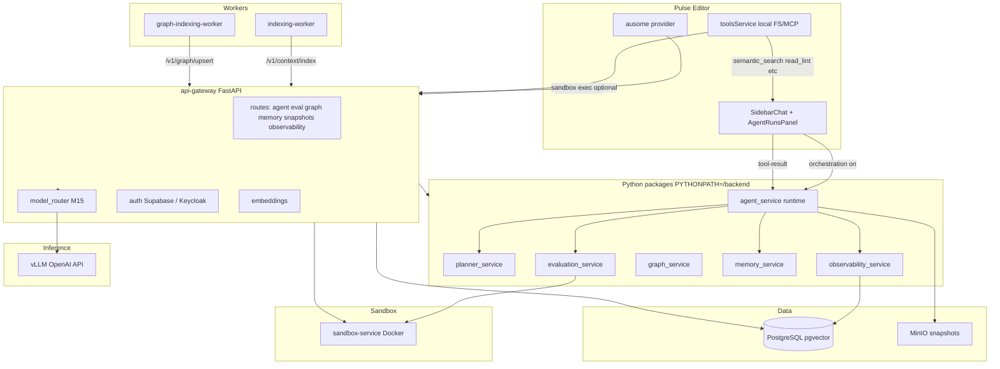

# Ausome AI Studio — Architecture

**Platform:** Ausome AI Studio | **Editor:** Pulse (desktop fork of Void)

## Standalone-first (default)

Pulse behaves like **Void** out of the box:

- Talks **directly** to configured LLM providers (OpenAI, Anthropic, Ollama, etc.).
- Runs the **local agent loop** in the editor: LLM proposes tools → Pulse executes them locally.
- **No Docker, Postgres, or gateway required** for daily use.

Ausome gateway features are **opt-in**:

| Feature | When active | Fallback when gateway off |
|---------|-------------|---------------------------|
| `ausome` LLM provider | User fills gateway URL + API key in Settings | Provider hidden until configured |
| Server agent orchestration | Setting on + `ausome` provider + `/health` OK | Local agent loop + notification |
| `semantic_search` tool | Gateway configured + context API up | Local `search_for_files` (keyword) |
| Docker sandbox terminal | `X-Ausome-Sandbox: true` in headers | Local integrated terminal |

## High-level diagram



## Hybrid agent orchestration (M7)

When Pulse **Server agent orchestration** is enabled with the `ausome` provider:

1. Pulse calls `POST /v1/agent/run` with `goal`, `pulse_thread_id`, `project_id`.
2. Gateway **agent_service** runs state machine: `planning → (approval?) → executing → verifying → completed|failed`.
3. Gateway returns `pending_tool` (e.g. `semantic_search`, `read_lint_errors`).
4. Pulse executes tool locally via existing `toolsService`, then `POST /v1/agent/runs/{id}/tool-result`.
5. Phases: **plan** (planner) → **code** (tool) → **review** (lint) → **test** (eval gate).

Pulse does **not** run the ReAct LLM loop in this mode; the gateway owns plan, state, and verification.

## Agent state machine

```
queued → planning → awaiting_approval? → executing → verifying → completed
                  ↘ failed / cancelled
```

Persisted in `agent_runs`, `agent_run_steps`, `agent_trace_spans`, `audit_logs`.

## Request flows

### Chat / FIM (non-orchestrated)

1. Pulse → `POST /v1/chat/completions` or `/v1/completions` with `X-Ausome-Task` header.
2. JWT validated; user upserted to `users` table.
3. Model router selects model by task (`chat`, `completion`, `reasoning`, `review`, `embedding`).
4. Proxy to vLLM; usage recorded when `X-Ausome-Run-Id` present.

### Semantic search

1. `POST /v1/context/search` — embed query via vLLM/stub, pgvector cosine search.
2. Indexing worker pushes chunks via `POST /v1/context/index` (`index_jobs` tracked).

### Observability (Phase A)

- Spans recorded for planner LLM, phase transitions, tools, eval.
- `GET /v1/agent/runs/{id}/trace` merges run, steps, spans, eval, snapshot, token cost.
- Pulse **Agent runs** panel lists runs by `pulse_thread_id`.

## Repository layout

| Path | Role |
|------|------|
| `backend/api-gateway/` | FastAPI app, routes, middleware, DB schemas |
| `backend/agent_service/` | Hybrid runtime state machine |
| `backend/planner_service/` | Plan generation |
| `backend/evaluation_service/` | Sandbox check suite |
| `backend/graph_service/` | Graph extract + query |
| `backend/memory_service/` | Project memories |
| `backend/observability_service/` | Spans, traces, cost |
| `backend/sandbox-service/` | Docker exec API |
| `workers/indexing/` | Embedding indexer |
| `workers/graph-indexing/` | Graph indexer |
| `ai/` | Model + cost config (`embeddings/config.yaml`) |
| `infrastructure/helm/` | K8s charts (vllm, ausome-studio) |
| `deployment/docker-compose.yml` | Local full stack |
| `src/vs/workbench/contrib/void/` | Pulse editor + Ausome integration |

## Pulse integration points

| Feature | Code |
|---------|------|
| `ausome` provider | `modelCapabilities.ts`, `sendLLMMessage.ausomeGateway.ts` |
| Gateway helper | `ausomeGatewayHelper.ts` — agent run, trace, list APIs |
| Hybrid agent loop | `chatThreadService.ts` — `_runGatewayAgent` |
| Agent Observatory UI | `sidebar-tsx/agent-runs/AgentRunsPanel.tsx` |
| Git + semantic tools | `toolsService.ts`, `prompts.ts` |
| Sandbox terminal | `terminalToolService.ts` when `X-Ausome-Sandbox: true` |
| FIM debounce (ausome) | `autocompleteService.ts` — 120ms |

## Security boundaries

- Production: gateway-only inference; no cloud keys in Pulse enterprise profile.
- RBAC: `admin`, `developer`, `viewer` on mutating routes.
- Sandbox: terminal via Docker when enabled.
- OPA + rate limit middleware on agent routes (M14).

See [SECURITY.md](SECURITY.md).

## Related

- [ROADMAP.md](ROADMAP.md) — M1–M16 milestones
- [PRODUCTIZATION.md](PRODUCTIZATION.md) — Phases A–I (observability done)
- [../FEATURES.md](../FEATURES.md) — Pulse feature inventory
- [../INDEX.md](../INDEX.md) — documentation map
