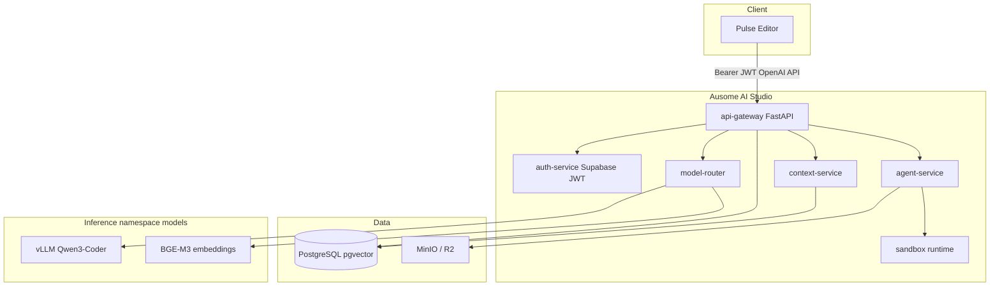

# Ausome AI Studio — Architecture

**Platform:** Ausome AI Studio | **Editor:** Pulse (desktop)

## System diagram

## Request flow

1. Pulse sends all LLM traffic to `ausome` provider → `POST /v1/chat/completions` (or `/v1/completions` for FIM).
2. Gateway validates Supabase JWT and resolves user role (RBAC).
3. Model router selects endpoint by task type (`chat`, `completion`, `embedding`, `rerank`, `reasoning`).
4. Context service handles `/v1/context/search` for semantic codebase retrieval.
5. Agent service logs tool runs to `agent_runs` and `audit_logs`.
6. Sandbox API executes terminal commands in per-workspace Docker containers when enabled.

## Repository layout

See [ROADMAP.md](ROADMAP.md) and root folders: `backend/`, `workers/`, `ai/`, `infrastructure/`, `deployment/`.

## Editor integration

- Provider: `ausome` in `src/vs/workbench/contrib/void/common/modelCapabilities.ts`
- Transport: OpenAI-compatible client → gateway base URL
- Tools: `semantic_search`, `git_status`, `git_commit`, `git_branch` in `toolsService.ts`

## Related

- [SECURITY.md](SECURITY.md)
- [ROADMAP.md](ROADMAP.md)
- [../CURSOR_DEV.md](../CURSOR_DEV.md)
